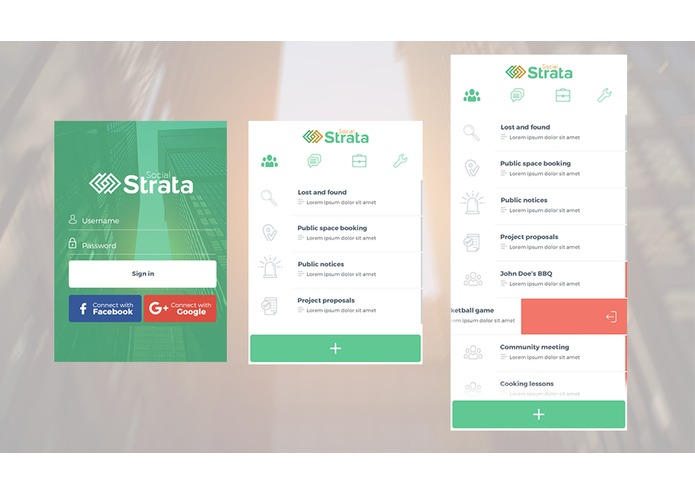
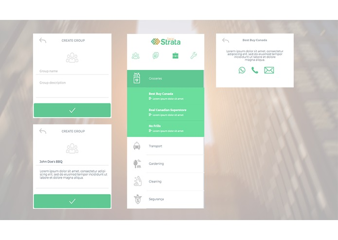
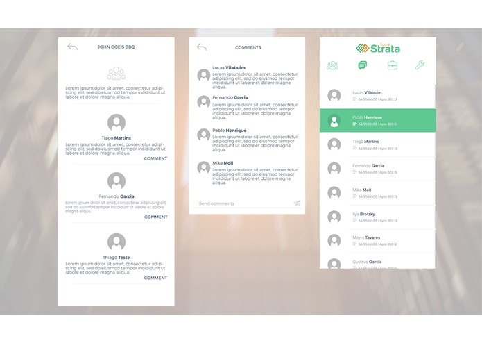
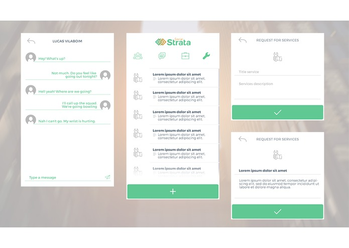

SocialStrata
==========

Social Strata was the winner project on VanHackathon 2016 on My Green Space section. This project was published first on [devpost](https://devpost.com/software/social-strata-uok3cw). This is an ionic application.

### Inspiration
Our inspiration was to solve people problems on their condominium community. We do understand there are a lot of problems going on like lack of social relationship and maintenance issue.

### What it does?
Social Strata will help people get in touch with their condominium community, landlords, create project proposals, get public notices, book public spaces and request maintenance when needed. It's a mobile app for everyone.

### How we built it
We built it using Ionic, AngularJS in our front end and we're using Ruby on Rails on our backend.

### Who built it?
[@pablohpsilva](https://github.com/pablohpsilva) - Frontend developer
[@vilaboim](https://github.com/lucasvilaboim) - Frontend developer
[@martinstiago](https://github.com/tiagomartinsaraujo) - Backend developer
[@garciafsouza](https://devpost.com/garciafsouza) - Designer

### What it looks like?

